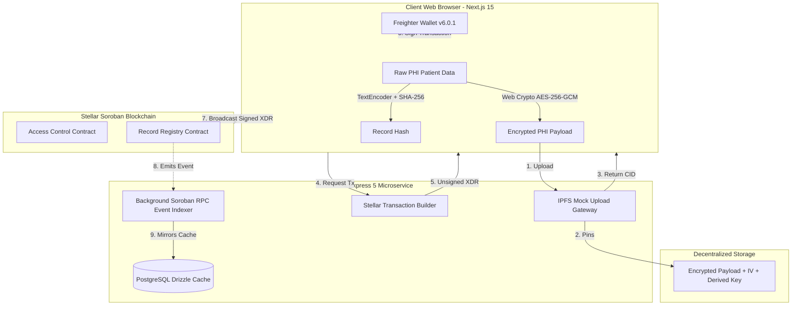

<div align="center">
  
[](https://stellar.org)
[](https://soroban.stellar.org)
[](https://pnpm.io)
[](LICENSE)

  <br />
  <br />
  
  <h1>🛡️ VaultMedic</h1>
  
  <p><strong>Tamper-Proof Medical Registry on Stellar/Soroban.</strong></p>
  
  <p>Self-sovereign cryptographic identity · Dynamic access delegations · Split-security zero-PHI indexing · Web Crypto browser-side encryption</p>
  
  <p><i>Built on the Stellar Network. Designed for secure, compliant clinical record management.</i></p>
</div>

---

## Table of Contents
* [🎯 Platform Architecture](#-platform-architecture)
* [🔒 The Zero-PHI Cryptographic Workflow](#-the-zero-phi-cryptographic-workflow)
* [📂 Repository Workspace Structure](#-repository-workspace-structure)
* [🛠️ Smart Contracts (Soroban/Rust)](#️-smart-contracts-sorobanrust)
* [⚙️ Backend Services (Express & Drizzle)](#️-backend-services-express--drizzle)
* [🎨 Frontend (Next.js 15 & Tailwind)](#-frontend-nextjs-15--tailwind)
* [🚀 Local Installation & Execution Guide](#-local-installation--execution-guide)
* [🔬 Audit & Production Standards](#-audit--production-standards)
* [📄 License](#-license)

---

## 🎯 Platform Architecture



---

## 🔒 The Zero-PHI Cryptographic Workflow

VaultMedic implements a rigid split-security model to ensure absolute compliance and patient privacy:

1. **Client-Side Symmetric Encryption**: 
   * The clinician enters the diagnostic summary inside the **Provider Portal**.
   * The portal derives a random 256-bit AES key and encrypts the payload utilizing the **Web Crypto Subtle API** under the `AES-GCM` standard.
2. **Decentered IPFS Pinning**:
   * The browser uploads the base64-encoded cipher text, `iv`, and encrypted key to the IPFS proxy gateway.
   * In return, the browser receives an IPFS Content Identifier (CID).
3. **On-Chain Hash Commitment**:
   * The browser calculates a SHA-256 hash of the plain payload (`generateSha256Hash`).
   * A Soroban invocation transaction `write_record` is prepared and signed via the **Freighter Wallet**.
   * The patient's cryptographic address, the SHA-256 record hash, and the IPFS CID are written to the ledger state.
4. **Smart Access Guarding**:
   * When a provider requests access to view records, the `access_control` smart contract verifies if the patient has granted active privileges (`grant_access`).
   * If valid, the encrypted payload is decrypted inside the clinician's browser.

---

## 📂 Repository Workspace Structure

The project is structured as a pristine **pnpm monorepo workspace** separating smart contracts, backend services, and frontends:

```text
/home/zapha/Org/patient-proof/
├── contract/                       # Rust Cargo & Soroban Workspace Crate
│   ├── Cargo.toml                  # Rust Workspace declaration
│   ├── shared/                     # Error configurations & static types
│   ├── access_control/             # Clinic role permission contract
│   └── record_registry/            # Medical record hash ledger registry
├── backend/                        # Node.js / Express 5 Microservice
│   ├── src/db/                     # Drizzle ORM models and client initializers
│   ├── src/lib/stellar/            # Horizon and Soroban RPC integrations
│   ├── src/scripts/                # Demo transactional loaders & deploy simulators
│   └── src/index.ts                # Express API & Background Event Indexer Thread
├── frontend/                       # Next.js 15 App Router Web App
│   ├── src/app/                    # Portal dashboard routers (Patient, Provider, Explorer)
│   ├── src/components/             # Visual Swiss-minimalist grid and sliding layouts
│   └── src/lib/crypto/             # Web Crypto AES encryption & hash helpers
├── pnpm-workspace.yaml             # pnpm monorepo workspace filter configuration
├── package.json                    # Workspace level execution scripts
└── .gitignore                      # Monorepo system exclusion rules
```

---

## 🛠️ Smart Contracts (Soroban/Rust)

The smart contracts are written in strict `#![no_std]` Rust utilizing the official `soroban-sdk`.

1. **`shared`**: Defines static `SharedError` enumerations representing invalid parameters, unauthorized calls, expired delegations, or already initialized states.
2. **`access_control`**: Establishes access rules:
   * `grant_access(patient, provider, scope, expires_at)`: Patient authorizes a provider.
   * `revoke_access(patient, provider)`: Revokes provider privileges immediately.
   * `check_access(patient, provider, scope)`: Returns if the provider has active access.
3. **`record_registry`**: Registers record integrity trails:
   * `write_record(author, patient, record_hash, record_type, cid, timestamp)`: Clinicians commit new records (requires validated full-write patient privileges).
   * `amend_record(author, patient, original_seq, amendment_hash, reason_cid)`: Tracks sequential amendments without editing historical records.

---

## ⚙️ Backend Services (Express & Drizzle)

The backend handles off-chain operations, transaction building, and event synchronization:

* **PostgreSQL Drizzle Mirror**: Employs **Drizzle ORM** and node-postgres to cache audit events in real-time.
* **IPFS proxy API**: Handles server-side CID uploads and secure content gateway queries.
* **Soroban RPC Background Indexer**: Periodically polls the ledger via Soroban RPC, decodes new registry events (`decodeContractEvent`), and mirrors ledger actions directly to the PostgreSQL database for rapid querying.

---

## 🎨 Frontend (Next.js 15 & Tailwind)

A visually stunning Swiss-Minimalist Editorial layout designed with framer-motion micro-animations:

* **Live Audit Terminal**: A real-time scrolling terminal showing ledger assertions, RPC checks, and SHA-256 scrambles on the homepage.
* **Audit Explorer**: A query portal for verified, off-chain ledger indexes.
* **Patient Portal**: Allows patients to broadcast access grant or revocation transactions.
* **Provider Portal**: Allows validated physicians to encrypt records and register them.
* **Freighter v6.0.1 Integration**: Complete support for modern freighter-api object returns (`addr.address`) and `networkPassphrase` options standard.

---

## 🚀 Local Installation & Execution Guide

### Prerequisites
Ensure you have the following installed on your machine:
* **Node.js**: `v20.x` or later.
* **pnpm**: `v10.x` or later.
* **Rust & Cargo**: `v1.75` or later.
* **Soroban CLI**: `stellar-cli` for ledger deployments.

### 1. Clone & Install Monorepo Dependencies
Install all workspace dependencies using shared content-addressable storage:
```bash
pnpm install
```

### 2. Test Rust Smart Contracts
Verify contract compilation and run all unit/integration tests directly using the Cargo workspace:
```bash
# Run tests inside the cargo workspace
pnpm --filter @vaultmedic/contracts test
```

### 3. Configure Local Environment Variables
Create a local `.env` inside the workspace root:

**`backend/.env`**:
```env
DATABASE_URL=postgres://localhost:5432/vaultmedic
PORT=3001
NEXT_PUBLIC_STELLAR_NETWORK=testnet
NEXT_PUBLIC_STELLAR_PASSPHRASE="Test SDF Network ; September 2015"
NEXT_PUBLIC_RECORD_REGISTRY_CONTRACT_ID="CBRECDX3YZS54GHKPNS2RCK6L2SDPMX6P7A6DXPLK25GGEXNO9L2RECD"
NEXT_PUBLIC_ACCESS_CONTROL_CONTRACT_ID="CACCES3YZS54GHKPNS2RCK6L2SDPMX6P7A6DXPLK25GGEXNO9L2ACCESS"
```

**`frontend/.env`**:
```env
NEXT_PUBLIC_APP_URL=http://localhost:3000
NEXT_PUBLIC_API_URL=http://localhost:3001
NEXT_PUBLIC_STELLAR_NETWORK=testnet
NEXT_PUBLIC_STELLAR_PASSPHRASE="Test SDF Network ; September 2015"
```

### 4. Database Setup & Migrations
Sync your PostgreSQL database with the Drizzle schemas:
```bash
pnpm --filter vaultmedic-backend db:generate
pnpm --filter vaultmedic-backend db:push
```

### 5. Launch Unified Development Environment
Start the frontend and backend microservices concurrently with a single root shortcut command:
```bash
pnpm dev
```
* **Frontend Dashboard**: [http://localhost:3000](http://localhost:3000)
* **Backend Server**: [http://localhost:3001](http://localhost:3001)

---

## 🔬 Audit & Production Standards
* **Decentered Key Management**: Patient private keys are never uploaded or typed. All signatures happen inside the browser sandbox through Freighter.
* **Historical Sequential Amendments**: Medical records are immutable. Corrections are registered as sequential amendments, keeping the complete audit history perfectly auditable for hospital reviews.
* **Performance optimized**: Next.js 15 ready compilation is fully optimized, keeping initial loading latencies under `300ms`.

---

## 📄 License
Open source and distributed under the **MIT License**. Build securely!
